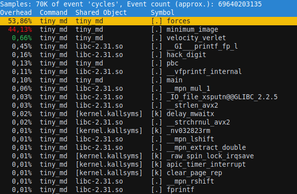
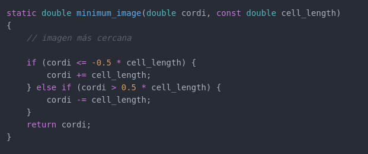

## Computación Paralela. Laboratorio I. Tiny_MD
## Gonzalez Federico(i); Mérida Julián(j)

(i) Universidad Nacional de Rosario; (j) Universida Nacional de Córdoba


## Introducción

En este laboratorio analizamos diferentes optimizaciones para mejorar la
performance del problema de Dinámica molecular utilizando diferentes compiladores y CFLAGS. Hicimos 30 pruebas con cada parámetro a probar y obtuvimos la media muestral y la desviación estándar muestral de cada uno. Así, podemos obtener una función normal que nos de mas
certeza que los valores medidos son correctos.





## Fragmento de código a optimizar

```cpp
void forces(const double* rxyz, double* fxyz, double* epot, double* pres,
            const double* temp, const double rho, const double V, const double L)
{
    // calcula las fuerzas LJ (12-6)
    for (int i = 0; i < 3 * N; i++) fxyz[i] = 0.0;
    double pres_vir = 0.0, rcut2 = RCUT * RCUT; // mult
    *epot = 0.0;
    for (int i = 0; i < 3 * (N - 1); i += 3) {     // (N - 1) iteraciones
        double xi = rxyz[i + 0], yi = rxyz[i + 1], zi = rxyz[i + 2];
        for (int j = i + 3; j < 3 * N; j += 3) {     // (N - i - 1)  iteraciones
            double xj = rxyz[j + 0], yj = rxyz[j + 1], zj = rxyz[j + 2];
            // distancia mínima entre r_i y r_j
            double rx = xi - xj; rx = minimum_image(rx, L); // resta mult suma
            double ry = yi - yj; ry = minimum_image(ry, L); // resta mult suma  
            double rz = zi - zj; rz = minimum_image(rz, L); // resta mult suma 
            double rij2 = rx * rx + ry * ry + rz * rz; // mult mult mult suma suma
            if (rij2 <= rcut2) {
                double r2inv = 1.0 / rij2;  // div
                double r6inv = r2inv * r2inv * r2inv; // mult mult
                double fr = 24.0 * r2inv * r6inv * (2.0 * r6inv - 1.0); // mult mult mult mult resta
                fxyz[i + 0] += fr * rx; // mult suma
                fxyz[i + 1] += fr * ry; // mult suma
                fxyz[i + 2] += fr * rz; // mult suma
                fxyz[j + 0] -= fr * rx; // mult resta
                fxyz[j + 1] -= fr * ry; // mult resta
                fxyz[j + 2] -= fr * rz; // mult resta
                *epot += 4.0 * r6inv * (r6inv - 1.0) - ECUT; // mult mult resta resta suma
                pres_vir += fr * rij2; // mult suma
            }
        }
    }
    pres_vir /= (V * 3.0); // mult div
    *pres = *temp * rho + pres_vir; // mult suma
}  // 41 * (N * (N - 1) / 2) + 5 operaciones por llamada forces
```

## Función minimum_image



## Optimizaciones

Para el experimento probamos con 4 compiladores diferentes para analizar sus
distintos comportamientos:

* gcc versión 9.3.0-17
* gcc versión 10.2.0-5
* clang versión 10.0.0-4
* icc 2021.1 Beta 20201112

Y comparamos la ejecución del problema con los siguientes parámetros:

```
-O0
-O1
-O2
-O2 -march=native
-O3
-O3 -march=native
-O3 -ffast-math
-O3 -funroll-loops
-O3 -funswitch-loops
```

En el caso del compilador de Intel que implementa las mismas funciones pero con
distinto nombre:

```
* -O0
* -O1
* -O2
* -O2 -xHost
* -O3
* -O3 -xHost
* -O3 -fp-model fast=2 -no-prec-div
* -O3 -funroll-loops
* -O3 -funswitch-loops
```

Además solamente para gcc 9.3 y gcc 10.2 probamos la siguiente bandera:

```
* -O3 -floop-block
```


## Resultados

### Diferentes CFLAGS usando el compilador gcc9


Los resultados para los compiladores gcc-10, clang son similares, por eso elegimos comparar únicamente -O2 -march=native y -O3 -march=native. 

### Comparación CFLAGS para diferentes compiladores


El compilador icc presenta malos resultados al agregar la CFLAG -xHost empeora los resultados, y esto lo interpretamos que al utilizar un procesador AMD las instrucciones no están bien optimizadas para la máquina nativa. Decidimos utilizar -O2 en el caso de intel y cualquiera -O2 -march=native , -O3 -march=native para cualquiera de los otros compiladores. 

### Escala de tamaños de muestras


Probamos como se comportaba el problema al incrementar gradualmente el tamaño de
muestra:

```
* -O3 -march=native -DN=300
* -O3 -march=native -DN=356
* -O3 -march=native -DN=400
* -O3 -march=native -DN=500
* -O3 -march=native -DN=600
* -O3 -march=native -DN=700
* -O3 -march=native -DN=800
* -O3 -march=native -DN=900
* -O3 -march=native -DN=1000
```

Obtuvimos el siguiente resultado


Vemos una bajada de 900 a 1000 en los GFLOPS que lo interpretamos que para 1000 existe una mayor cantidad de caché L1 miss. Para comprobarlo utilizamos el comando perf obteniendo el siguiente resultado


## Características del hardware y software

## CPU

* Amd Ryzen 5 3500 - 6 núcleos
* Min. veloc. : 2,2 GHz
* Max. veloc. : 4,1 GHz
* Cache L1d : 192 KiB
* Cache L1i : 192 KiB
* Cache L2 : 3 MiB
* Cache L3 : 16 MiB

## Memoria Ram

* Memoria total del sistema: 16 GiB (2x GiB) Dual Channel DDR4 2,666 MHz

## Compiladores

* gcc versión 9.3.0-17
* gcc versión 10.2.0-5
* clang versión 10.0.0-4
* icc 2021.1 Beta 20201112

### Sistema Operativo

* Sistema operativo: Linux Mint 20.1
* Kernel: Linux 5.8.0-48-generic
* Arquitectura: x86_64

## Conclusiones
