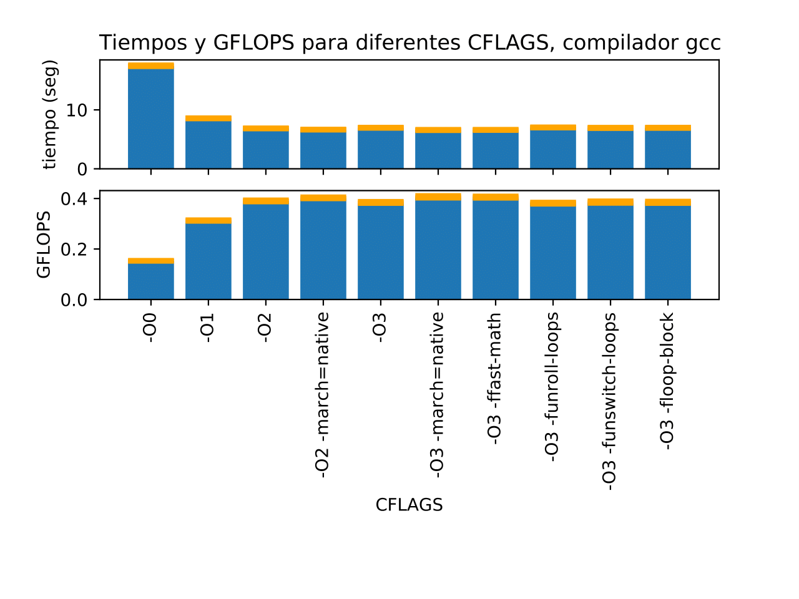
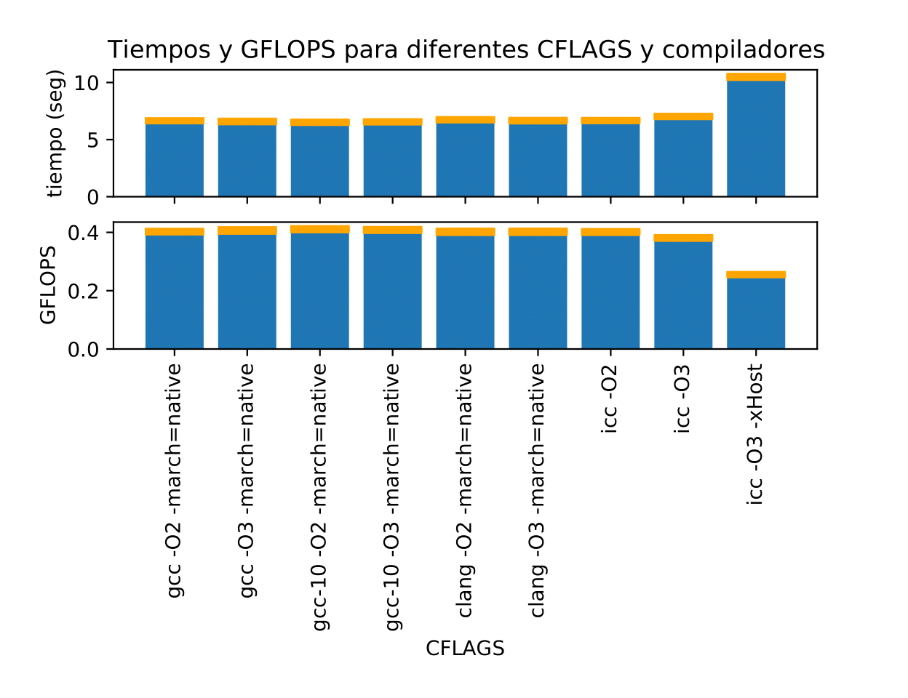
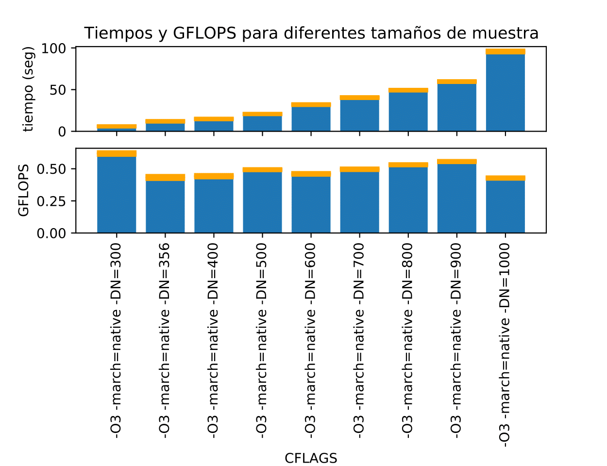
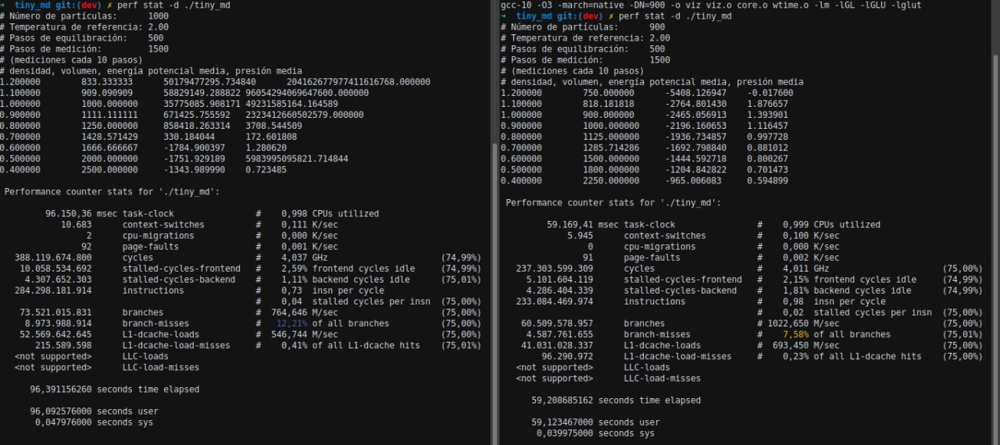
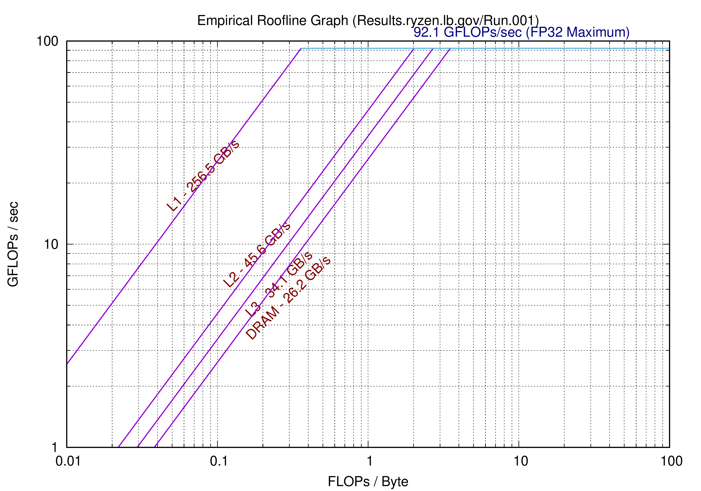

## Computación Paralela. Laboratorio I. Tiny_MD
## González Federico(i); Mérida Julián(j)

(i) Universidad Nacional de Rosario; (j) Universida Nacional de Córdoba


# Introducción

En este laboratorio analizamos diferentes optimizaciones para mejorar la
performance del problema de Dinámica molecular utilizando diferentes
compiladores y CFLAGS.
Para obtener los resultados hicimos 30 pruebas con cada parámetro a probar y
obtuvimos la media muestral y la desviación estándar muestral de cada uno. Así,
pudimos obtener una función normal que nos dio mas certeza que los valores
medidos fueran correctos.


## Código a optimizar

Realizando un profiling con Perf pudimos comprobar que el mayor tiempo de
computo en el programa lo tienen las funciones `forces` y `minimum_image`.


Buscando en el código de todo el programa, pudimos ver que `minimum_image` solo se llama dentro de `forces` y es una función con muy pocas operaciones, por lo que el compilador seguramente haga inlining dentro de `forces`.


Ademas, `forces` es una función con dos ciclos anidados
que iteran sobre el tamaño de la simulación, o el número de particulas
simuladas.

```c

void forces(const double* rxyz, double* fxyz, double* epot, double* pres,
            const double* temp, const double rho, const double V, const double L)
{
    // calcula las fuerzas LJ (12-6)
    for (int i = 0; i < 3 * N; i++) fxyz[i] = 0.0;
    double pres_vir = 0.0, rcut2 = RCUT * RCUT;
    *epot = 0.0;
    for (int i = 0; i < 3 * (N - 1); i += 3) {
        double xi = rxyz[i + 0], yi = rxyz[i + 1], zi = rxyz[i + 2];
        for (int j = i + 3; j < 3 * N; j += 3) {
            double xj = rxyz[j + 0], yj = rxyz[j + 1], zj = rxyz[j + 2];
            // distancia mínima entre r_i y r_j
            double rx = xi - xj; rx = minimum_image(rx, L);
            double ry = yi - yj; ry = minimum_image(ry, L);  
            double rz = zi - zj; rz = minimum_image(rz, L);
            double rij2 = rx * rx + ry * ry + rz * rz;
            if (rij2 <= rcut2) {
                double r2inv = 1.0 / rij2;
                double r6inv = r2inv * r2inv * r2inv;
                double fr = 24.0 * r2inv * r6inv * (2.0 * r6inv - 1.0);
                fxyz[i + 0] += fr * rx;
                fxyz[i + 1] += fr * ry;
                fxyz[i + 2] += fr * rz;
                fxyz[j + 0] -= fr * rx;
                fxyz[j + 1] -= fr * ry;
                fxyz[j + 2] -= fr * rz;
                *epot += 4.0 * r6inv * (r6inv - 1.0) - ECUT;
                pres_vir += fr * rij2;
            }
        }
    }
    pres_vir /= (V * 3.0);
    *pres = *temp * rho + pres_vir;
}  
```

Contando la cantidad de operaciones de punto flotante que se realizan en una
llamada a esta función y la cantidad de veces que se re calculan las fuerzas en
una simulación, pudimos estimar los GFLOPS del programa total dividiendo sobre
el tiempo de ejecución total del programa. Así conseguimos una estimación que puede
crecer a medida que incrementamos el  tamaño de muestra.


## Optimizaciones

Para el experimento probamos con 4 compiladores diferentes para analizar sus
distintos comportamientos:

* gcc versión 9.3.0-17
* gcc versión 10.2.0-5
* clang versión 10.0.0-4
* icc 2021.1 Beta 20201112

Y comparamos la ejecución del problema con los siguientes parámetros:

```
-O0
-O1
-O2
-O2 -march=native
-O3
-O3 -march=native
-O3 -ffast-math
-O3 -funroll-loops
-O3 -funswitch-loops
```

Y solo para gcc 9.3 y gcc 10.2 probamos la siguiente bandera

```
-O3 -floop-block
```

y obtuvimos las siguientes métricas:

Para GCC-9:


|  Flags               |  Gflops  | Desviación |          
|  --------------------| -------  | :----------:
| -O0                  | 0.153156 | 0.001022   |
| -O1                  | 0.312658 | 0.002192   |
| -O2                  | 0.390438 | 0.003114   |
| -O2 -march=native    | 0.402610 | 0.002896   |
| -O3                  | 0.384440 | 0.003191   |
| -O3 -march=native    | 0.406484 | 0.004280   |
| -O3 -ffast-math      | 0.405531 | 0.003547   |
| -O3 -funroll-loops   | 0.381612 | 0.003195   |
| -O3 -funswitch-loops | 0.385727 | 0.004073   |
| -03 -floop-block     | 0.384896 | 0.003661   |

* Mejor resultado `-O3 -march=native`.
* 0.25 GFLOPS de diferencia entre no optimizar y la mejor optimización.
* 265 % de mejora.


Para GCC-10:

| Flags                | Gflops   | Desviación |
| -------------------- | ---------| :--------: |
| -O0                  | 0.150072 | 0.000922   |
| -O1                  | 0.319527 | 0.002589   |
| -O2                  | 0.397079 | 0.002804   |
| -O2 -march=native    | 0.410861 | 0.003709   |
| -O3                  | 0.391815 | 0.002640   |
| -O3 -march=native    | 0.408323 | 0.003281   |
| -O3 -ffast-math      | 0.401090 | 0.002926   |
| -O3 -funroll-loops   | 0.391889 | 0.002451   |
| -O3 -funswitch-loops | 0.391666 | 0.003399   |
| -03 -floop-block     | 0.391276 | 0.003364   |

* Mejor resultado `-O2 -march=native`.
* 0.26 GFLOPS de diferencia entre no optimizar y la mejor optimización.
* 274 % de mejora.

Para Clang:

| Flags               |  Gflops  | Desviación |
| --------------------| -------- | :---------:|
|-O0                  | 0.140274 | 0.001120   |
|-O1                  | 0.318532 | 0.003306   |
|-O2                  | 0.381312 | 0.002994   |
|-O2 -march=native    | 0.397174 | 0.003411   |
|-O3                  | 0.394721 | 0.003314   |
|-O3 -march=native    | 0.401936 | 0.004032   |
|-O3 -ffast-math      | 0.391294 | 0.003611   |
|-O3 -funroll-loops   | 0.394476 | 0.003345   |
|-O3 -funswitch-loops | 0.392948 | 0.003309   |

* Mejor resultado `-O3 -march=native`.
* 0.26 GFLOPS de diferencia entre no optimizar y la mejor optimización.
* 287 % de mejora.

En el caso del compilador de Intel que implementa las mismas funciones pero con
distinto nombre:

```
* -O0
* -O1
* -O2
* -O2 -xHost
* -O3
* -O3 -xHost
* -O3 -fp-model fast=2 -no-prec-div
* -O3 -funroll-loops
* -O3 -funswitch-loops
```

Tenemos:

| Flags                                 |  Gflops  | Desviación |
| ------------------------------------- | -------- | :--------: |
|-O0                                    | 0.134154 | 0.000864   |
|-O1                                    | 0.242815 | 0.001558   |
|-O2                                    | 0.401408 | 0.003330   |
|-O2 -xHost                             | 0.266811 | 0.001698   |
|-O3                                    | 0.380901 | 0.003035   |
|-O3 -xHost                             | 0.255146 | 0.002222   |
|-O3 -fp-model fast=2 -no-prec-div      | 0.384143 | 0.003462   |
|-O3 -funroll-loops                     | 0.381219 | 0.004351   |
|-O3 -funswitch-loops                   | 0.380133 | 0.002820   |

* Mejor resultado `-O2`.
* 0.27 GFLOPS de diferencia entre no optimizar y la mejor optimización.
* 299 % de mejora.


## Resultados

### Diferentes CFLAGS usando el compilador gcc9




Los resultados para los compiladores gcc-10, clang son similares, por eso
elegimos comparar únicamente -O2 -march=native y -O3 -march=native.

### Comparación CFLAGS para diferentes compiladores




El compilador icc presenta malos resultados al agregar la CFLAG -xHost esto lo
interpretamos como que al utilizar un procesador AMD las instrucciones no están
bien optimizadas para la máquina nativa. Decidimos utilizar -O2 en el caso de
intel y cualquiera -O2 -march=native , -O3 -march=native para cualquiera de los
otros compiladores.

## Escala de tamaños de muestras


Probamos como se comportaba el problema al incrementar gradualmente el tamaño de
muestra:

```
* -O3 -march=native -DN=300
* -O3 -march=native -DN=356
* -O3 -march=native -DN=400
* -O3 -march=native -DN=500
* -O3 -march=native -DN=600
* -O3 -march=native -DN=700
* -O3 -march=native -DN=800
* -O3 -march=native -DN=900
* -O3 -march=native -DN=1000
```

Obtuvimos los siguientes resultados:

| Flags                     |  Gflops  | Desviación |   Tiempo  | Desviación Tiempo |
| :-----------------------: | -------- | :--------: | :-------: | :---------------: |
|-O3 -march=native -DN=300  | 0.618502 | 0.009628   | 5.947515  | 0.093336          |
|-O3 -march=native -DN=356  | 0.432317 | 0.011426   | 11.993440 | 0.317216          |
|-O3 -march=native -DN=400  | 0.442233 | 0.008798   | 14.802072 | 0.287617          |
|-O3 -march=native -DN=500  | 0.492772 | 0.003651   | 20.760197 | 0.153864          |
|-O3 -march=native -DN=600  | 0.460269 | 0.006242   | 32.020254 | 0.434393          |
|-O3 -march=native -DN=700  | 0.496186 | 0.005737   | 40.436022 | 0.466654          |
|-O3 -march=native -DN=800  | 0.531201 | 0.003839   | 49.338128 | 0.356986          |
|-O3 -march=native -DN=900  | 0.556307 | 0.004051   | 59.633882 | 0.431561          |
|-O3 -march=native -DN=1000 | 0.427939 | 0.004693   | 95.722825 | 1.030740          |

Y acá vemos sus gráficas:




Vemos una bajada de 900 a 1000 en los GFLOPS que lo interpretamos que para 1000
existe una mayor cantidad de caché L1 miss. Para comprobarlo utilizamos el
comando perf obteniendo el siguiente resultado:



## Características del hardware y software

### CPU

* Amd Ryzen 5 3500 - 6 núcleos
* Min. veloc. : 2,2 GHz
* Max. veloc. : 4,1 GHz
* Cache L1d : 192 KiB
* Cache L1i : 192 KiB
* Cache L2 : 3 MiB
* Cache L3 : 16 MiB

### Memoria Ram

* Memoria total del sistema: 16 GiB (2x GiB) Dual Channel DDR4 2,666 MHz

### Sistema Operativo

* Sistema operativo: Linux Mint 20.1
* Kernel: Linux 5.8.0-48-generic
* Arquitectura: x86_64

### Benchmark con Empirical Roofline Toolkit



Gracias a este grafico podemos apreciar los anchos de banda máximos teóricos:

*  Max. Cache L1 : 256,5 GB/s
*  Max. Cache L2 : 45,5 GB/s
*  Max. Cache L3 : 34,1 GB/s
*  Max. Memoria Ram : 26,2 GB/s

Y el máximo ancho de banda del procesador:

* Tasa máxima de Gflops por procesador : 92,1 Gflops/s (operaciones FP 32bit).

# Conclusiones

* Generamos una estimación de los GFlops totales del programa que nos permitirá
 realizar comparaciones con las siguientes técnicas que realizaremos en los
 proximos laboratorios.

* Hicimos una recorrida con diferentes flags y encontramos que para este
procesador AMD, los diferentes compiladores GCC9, GCC10 y Clang funcionaron
óptimamente con los FLAGS -O2 -march=native u -O3 -march=native.

* Agregar más flags al compilador no mejoró los resultados.

* Con el compilador de Intel utilizar el Flag -xHost produjo malos resultados (para
este procesador AMD).

* Con ICC -O2 se obtuvieron resultados similares a los de GCC con -O2
-march=native y -O3 -march=native (gcc-9.3 y gcc-10.2 respectivamente).

* La cache L1 se empieza a saturar con números de partículas cercanos a 1000.
