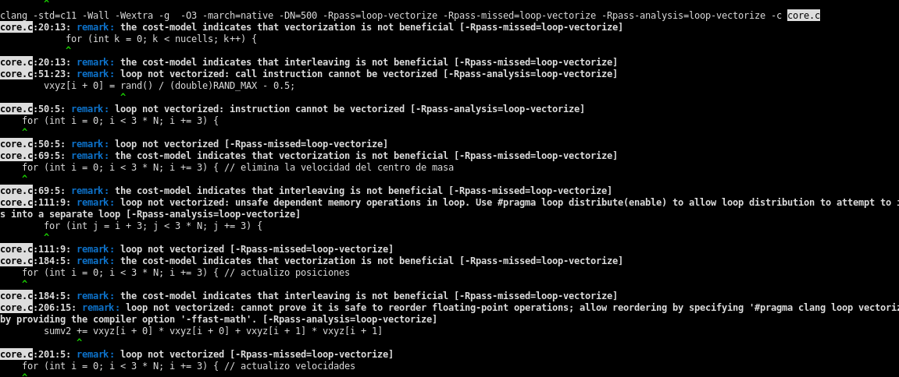
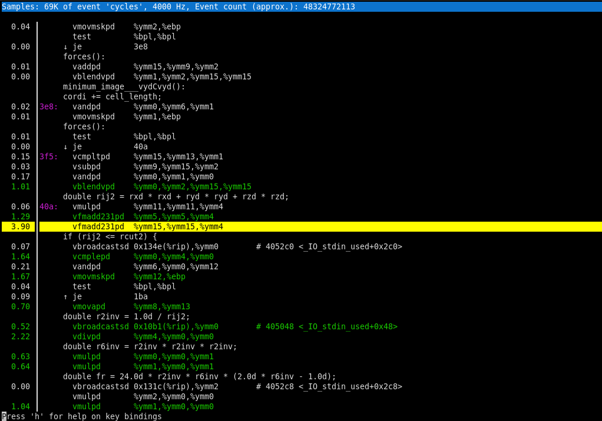
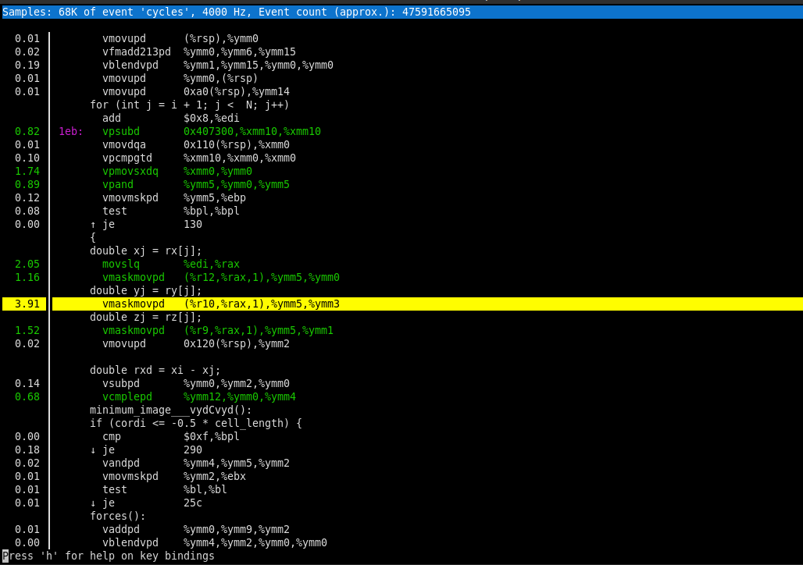
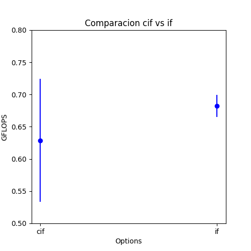

## Computación Paralela. Laboratorio II. Tiny_MD
## González Federico(i); Mérida Julián(j)

(i) Universidad Nacional de Rosario; (j) Universidad Nacional de Córdoba


# Introducción

En este laboratorio buscamos alternativas para conseguir utilizar el conjunto de instrucciones vectoriales Avx2 para mejorar la performance de nuestro problema `Tiny Molecular Dinamics`. En un primer intento tratamos de ayudar al compilador a vectorizar automáticamente cambiando la estructura de datos del problema de AoS a Soa, simplificando funciones inline y pasando distintas flags para identificar donde el compilador no podía vectorizar, principalmente analizamos la función forces.

Estas ideas no funcionaron así que proseguimos a implementar el problema central del proyecto, la ejecución de la función `forces`, en ISPC. Una vez hecho esto conseguimos vectorizar consiguiendo una mejora aproximada del 70% con respecto a los mejores resultados del lab 1.

Por último, mientras estábamos obteniendo las métricas, descubrimos que al utilizar el compilador Clang de Intel que viene dentro del conjunto de herramientas oneApi(_Intel(R) oneAPI DPC++ Compiler 2021.2.0_) el problema se resolvía por si solo ya que este compilador si podía vectorizar forces automáticamente, tanto para las versiones del código AoS como SoA. Es decir con Clang de Intel utilizando el programa original (sin ninguna modificación) conseguimos la misma performance que usando ISPC. En cunto al uso de ISPC en este problema, la ventaja que pudimos obervar es que podemos lograr la mejora del 70% con cualquier compilador.


# Optimizaciones

## Análisis código auto vectorizable con Clang

Nuestro primer intento consistió en correr Clang con las siguientes flags para intentar encontrar donde estaban los problemas al vectorizar:

* -Rpass=loop-vectorize
* -Rpass-missed=loop-vectorize
* -Rpass-analysis=loop-vectorize

Y obtuvimos los siguientes datos:



En estas líneas, sabiendo que la función forces va desde las líneas 91 hasta 164 de `core.c`, vemos que el compilador no está vectorizando ningún ciclo.

## Ayudas al compilador

Intentamos pasarle el parametro `#pragma loop distribute(enable)` pero el mensaje siguió siendo el mismo. Luego probamos modificando la estructura original de `Array of Structures` a `Structures of Array`. Así, ahora la función forces recibe 6 arreglos:

*  3 arreglos rx, ry, y rz para las posiciones de las particulas, en vez de un arreglo rxyz.
*  3 arreglos fx, fy, y fz para las fuerzas de las particulas, en vez un fxyz.

Pero el resultado fue el mismo, clang informa que no pudo vectorizar ningún loop. Esto mismo fue verificado con
compiladores intel y gcc dando resultados también negativos.

Por último, antes de implementar `forces` en `ISPC`, probamos transformar `minimum_image` en una función inline dentro de forces pensando que quizás esta era una causa por la que el compilador tenía problemas para vectorizar, pero una vez más, no hubo éxito.

## Implementación de forces en ISPC

Primero implementamos `minimum_image` en `ISPC` ya que esta se llama en `forces` y queremos que también se vectorice. Su implementación es igual al código original (únicamente tuvimos que quitar `static` en el return de la función). Como dentro de la función solo se hace una comparación, es totalmente paralelizable.

En cuanto a la implementación de `forces` partimos como base de la versión SoA, que resulta más sencilla de paralelizar, a continuación vemos la nueva implementación de forces.

```C
export void forces(const double uniform rx[], const double uniform ry[],
                   const double uniform rz[], double uniform fx[],
                   double uniform fy[], double uniform fz[],
                   uniform double uniform epot[],
                   uniform double uniform pres[],
                   uniform const double uniform temp[],
                   uniform const double rho, uniform const double V,
                   uniform const double L)
{

foreach(i = 0 ... N)
{
    fx[i] = 0.0d;
    fy[i] = 0.0d;
    fz[i] = 0.0d;
}

uniform double pres_vir;
double pres_vir_partial = 0.0d ;
uniform double rcut2 = RCUT * RCUT;
double epot_partial = 0.0d;


foreach(i = 0 ... N-1)
{
    double xi = rx[i];
    double yi = ry[i];
    double zi = rz[i];

    for (int j = i + 1; j <  N; j++)
    {
        double xj = rx[j];
        double yj = ry[j];
        double zj = rz[j];

        double rxd = xi - xj;
        rxd = minimum_image(rxd, L);
        double ryd = yi - yj;
        ryd = minimum_image(ryd, L);
        double rzd = zi - zj;
        rzd = minimum_image(rzd, L);

        double rij2 = rxd * rxd + ryd * ryd + rzd * rzd;
        if (rij2 <= rcut2) {
            double r2inv = 1.0d / rij2;
            double r6inv = r2inv * r2inv * r2inv;

            double fr = 24.0d * r2inv * r6inv * (2.0d * r6inv - 1.0d);

            fx[i] += fr * rxd;
            fy[i] += fr * ryd;
            fz[i] += fr * rzd;

            fx[j] -= fr * rxd;
            fy[j] -= fr * ryd;
            fz[j] -= fr * rzd;

            epot_partial +=  4.0d * r6inv * (r6inv - 1.0d) - ECUT;
            pres_vir_partial += fr * rij2 ;
        }
    }
}

*epot=reduce_add(epot_partial);
pres_vir=reduce_add(pres_vir_partial);
pres_vir /= (V * 3.0d);
*pres = *temp * rho + pres_vir;
}
```

El código implementado es muy similar al original salvo que es necesario hacer el `reduce` de todas las sumas parciales que se calculan en cada una de las `programCount` instancias y deben declararse como `uniform` las constantes y variables de entrada que toma la función.

## Intento de mejora implementación ISPC

Una mejora que quisimos implementar fue reemplazar el if del segundo ciclo por un cif, ya que pensabamos que este camino se toma más veces y por lo tanto el programa daría un mejor rendimiento.

Al probarlo, utilizando `perf record` y `perf report` pudimos ver que la instrucción más cargada en el caso del if es `vfmadd231pd`, la cual constituye el 3.90% del total de ciclos de ejecución de la función forces.



Y para el caso del cif, esta es `vmaskmovpd` la cual es producto del cálculo de máscaras que utiliza el con `coherent if`



Luego, al realizar 10 simulaciones para cada caso, obtuvimos la siguiente gráfica:



Por lo tanto, concluimos que utilizar el cif no era conveniente para esta implementación, ya que en la mayoría de casos su desempeño fue peor al del if.


## Descubrimiento Intel DPC++ oneApi Clang

Cuando estábamos realizando simulaciones para obtener las métricas finales de este informe, notamos que luego de setear las variables en `setvars.sh` para usar `icc` la llamada a clang se sobreescribía con el compilador `DPC++ Intel oneApi Clang`.

Al probarlo vimos que este compilador autovectorizaba tanto las versiones AoS y SoA, sin utilizar `ISPC` y los resultados obtenidos eran iguales a los de la implementación con `forces.ispc`. Por lo tanto, usando este compilador no habría necesidad de re-implementar código.

## Compiladores

Para poder obtener el mejor resultado de la nueva implementacion del programa, usamos las siguientes versiones de compiladores:

* Intel(R) oneAPI DPC++ Compiler 2021.2.0 (Intel oneApi Clang)}
* Debian clang version 11.0.1-2}
* GCC versión 5.4.1-4}
* ICC 2021.2.0 (sgcc version 10.2.1 compatibility)}


# Resultados

# Conclusiones

*  El código en ISPC tiene una performance aproximadamente 70% mejor.
*  Utilizar cif en forces.ispc no mejoró el rendimiento.
*  El compilador Clang DPC++ de Intel vectoriza todo el código automáticamente, tanto las versiones AoS como SoA.
