## Computación Paralela. Laboratorio III. Tiny_MD
## González Federico(i); Mérida Julián(j)

(i) Universidad Nacional de Rosario; (j) Universidad Nacional de Córdoba


# Introducción

En este laboratorio buscamos modificar el código del problema para paralelizar
su ejecución y así aprovechar todos los núcleos de los procesadores de `zx81` y
`Jupiterace`.

Para conseguir esto, queríamos mantener la implementación que hicimos de
`forces` en ISPC del laboratorio anterior, es por esto que la modificación
consistió en trabajar sobre el cálculo de cada fila de la matriz de fuerzas
independientemente. Es decir, ya no utilizamos solamente la matriz diagonal
superior. De esta forma, conseguimos que no existan `race conditions` de
escritura entre vecinos.


# Objetivos

## Paralelizacion de forces

* Mantener la implementación del laboratorio 2 en de `forces.ispc` solo
  cambiando el foreach por del ciclo interno.

* Distribuir el trabajo de `forces` en multiples hilos para mejorar la
  performance del problema.


# Modificaciones

## Modificacion en forces

Con las modificaciones sobre forces, el código quedó de la siguiente manera:

``` C
export void forces(const double uniform rx[],
                   const double uniform ry[],
                   const double uniform rz[],
                   double uniform fx[],
                   double uniform fy[],
                   double uniform fz[],
                   uniform double epot[],
                   uniform double pres[],
                   uniform const double uniform temp[],
                   uniform const double rho,
                   uniform const double V,
                   uniform const double L,
                   uniform const int32 row)
{

//        fx[row] = 0.0d;
//        fy[row] = 0.0d;
//        fz[row] = 0.0d;

    uniform double pres_vir = 0.0;
//    *epot = 0.0;
    uniform double rcut2 = RCUT * RCUT;
    uniform const double RCUT12 = RCUT * RCUT * RCUT * RCUT * RCUT * RCUT *
                                RCUT * RCUT * RCUT * RCUT * RCUT * RCUT;

    uniform const double RCUT6  = RCUT * RCUT * RCUT * RCUT * RCUT * RCUT;
    uniform const double ECUT = 4.0 * (1/(RCUT12) - 1/(RCUT6));
    //#define ECUT (4.0 * (pow(RCUT, -12) - pow(RCUT, -6)))
    uniform double L2 = 0.5 * L;

    double fxi = 0.0;
    double fyi = 0.0;
    double fzi = 0.0;
    double epot_partial = 0.0d;
    double pres_vir_partial = 0.0d ;

	foreach (j = 0 ... (N-1))
    {
	    if(j != row)
        {
            double xi = rx[row];
            double yi = ry[row];
            double zi = rz[row];

            double xj = rx[j];
            double yj = ry[j];
            double zj = rz[j];

            double rxd = xi - xj;
            double ryd = yi - yj;
            double rzd = zi - zj;

            rxd = minimum_image(rxd, L);
            ryd = minimum_image(ryd, L);
            rzd = minimum_image(rzd, L);

            double rij2 = rxd * rxd + ryd * ryd + rzd * rzd;

            if (rij2 <= rcut2)
            {
                double r2inv = 1.0d / rij2;
                double r6inv = r2inv*r2inv*r2inv;

                double fr = 24.0d * r2inv * r6inv * (2.0d * r6inv - 1.0d);

                fxi += fr * rxd;
                fyi += fr * ryd;
                fzi += fr * rzd;


                epot_partial +=  4.0d * r6inv * (r6inv - 1.0) - ECUT;
                pres_vir_partial += fr * rij2 ;
            }
        }
    }
    fx[row] += reduce_add(fxi);
    fy[row] += reduce_add(fyi);
    fz[row] += reduce_add(fzi);
    *epot += reduce_add(epot_partial) / 2;
    *pres += reduce_add(pres_vir_partial) / 2 / (V * 3.0d);
}
```

Principalmente los cambios que introducimos son los siguientes:


* Forces ahora recibe el i correspondiente a la columna de la matriz de fuerzas
  que tiene que actualizar.

* Cambiar los límites del ciclo internet de i+1 a N-1 por 0 hasta N-1 y
  eliminamos las actualizaciones de las fuerzas de los vecinos. De esta manera
  estamos calculando las fuerzas para cada i individualmente únicamente evitando
  los problemas de actualización a memoria entre hilos.

* Como ahora recorremos toda la matriz, ahora debemos evitar escribir dos veces
  sobre la diagonal. Por ello, agregamos el condicional `if(j != row)`.

* Al recorrer toda la matriz, debemos dividir la acumulación de `epot` y `pres`
  por dos para no estar sumando dos veces los mismos valores.

## Idea física para independizarnos de las partículas
El concepto físico en que nos basamos para calcular las partículas de forma
independiente consiste en: basado en el hecho de que los potenciales
Vij=Vji podemos remplazar la sumatoria (bucle interno) por una sumatoria
que comience desde cero y finalmente dividir los resultados a la mitad. Esto se
representa en las siguientes ecuaciones:


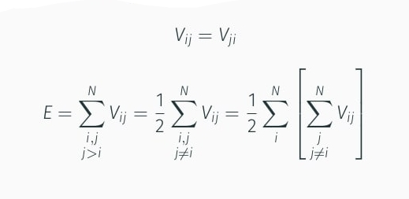


## Llamada a forces

Ahora el bucle que itera sobre i se declara fuera de la función. Así, se pueden
llamar a N-1 instancias de forces para que se ejecuten en paralelo.

``` C
    #pragma omp parallel
    {
        double epot_aux = 0;
        double pres_aux = 0;

        #pragma omp for
        for (int i = 0; i < N - 1; i += 1) {
            forces(rx, ry, rz, fx, fy, fz, &epot_aux, &pres_aux, temp, rho, V, L, i); // actualizo fuerzas
        }
        #pragma omp critical
        *epot += epot_aux;
        *pres += pres_aux;
    }
```

Es importante destacar que dentro de la forces se actualizan las variables
`epot` y `pres` por lo tanto debemos sincronizar luego de la salida del
`pragma omp for` la correcta actualización de sus valores.

Para esto definimos dos nuevas variables auxiliares `epot_aux` y `pres_aux` que
son las encargadas de acumular las variaciones de `epot` y `pres` para cada
hilo. Luego mediante el uso de la sección critica podemos acumular los
resultados en las variables originales.

Si no aplicaramos esta sincronización entre hilos tendríamos una
`race condition` de `RAW` (o read after write).

## Plataforma de cálculos

Los simulaciones se corrieron sobre Jupiterace y sobre zx81. Ambas tienen las
mismas prestaciones:

CPU:

 * Intel(R) Xeon(R) CPU E5-2680 v4 @ 2.4
 * 28 cores, 56 threads con smt habilitado,
 * Processor frequency : 2.4 - 3.3 GHz
 * Caches:
    * L1 data: 896 KiB
    * L1 instr.: 896 KiB
    * L2: 7 MiB
    * L3: 70 MiB

Memoria:

* Memoria RAM: 128 GB

## Compiladores

En este laboratorio utilizamos GCC-10 para la obtención de las métricas:

* GCC-10 (gcc version 10.2.1 20210110 (Debian 10.2.1-6))

También, comprobamos con

* Intel Clang ((Intel(R) oneAPI DPC++ Compiler 2021.2.0 (2021.2.0.20210317))
* Clang-11 (Debian clang version 11.0.1-2)

que los resultados obtenidos fuesen fiables revisando que los valores sean similares.


# Resultados

## Escalabilidad para distintos hilos con N=500


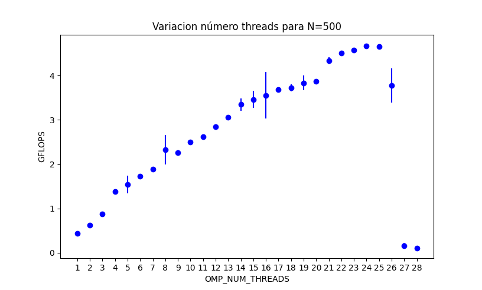


|  OMP_NUM_THREADS   |  GFLOPS  |  Tiempo   |
| :-----:            | :------: | :-----:   |
|  1                 |   1.010  |  10.40    |
|  2                 |   0.617  |  15.438   |
|  3                 |   0.882  |  12.692   |
|  4                 |   1.375  |  10.260   |
|  5                 |   1.546  |  8.761    |
|  6                 |   1.734  |  6.672    |
|  7                 |   1.882  |  6.982    |
|  8                 |   2.326  |  6.102    |
|  9                 |   2.259  |  5.833    |
|  10                |   2.497  |  5.580    |
|  11                |   2.624  |  5.150    |
|  12                |   2.842  |  4.887    |
|  13                |   3.058  |  4.966    |
|  14                |   3.350  |  4.507    |
|  15                |   3.464  |  4.526    |
|  16                |   3.557  |  4.451    |
|  17                |   3.681  |  4.228    |
|  18                |   3.723  |  4.230    |
|  19                |   3.837  |  4.055    |
|  20                |   3.874  |  3.992    |
|  21                |   4.339  |  3.773    |
|  22                |   4.506  |  3.738    |
|  23                |   4.579  |  3.627    |
|  24                |   4.670  |  3.592    |
|  25                |   4.663  |  3.589    |
|  26                |   3.781  |  3.744    |
|  27                |   0.162  |  3.786    |
|  28                |   0.108  |  79.379   |


## Datos escalabilidad para distintos hilos con N=1372


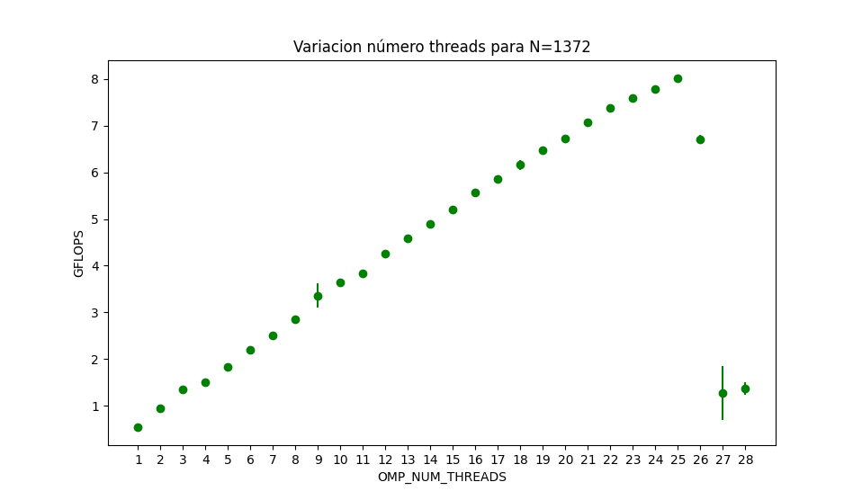


|  OMP_NUM_THREADS   |  GFLOPS  |  Tiempo   |
| :-----:            | :------: | :-----:   |
|  1                 |  1.37    |  56.3     |
|  2                 |  0.941   |  78.409   |
|  3                 |  1.354   |  65.463   |
|  4                 |  1.496   |  52.086   |
|  5                 |  1.837   |  43.162   |
|  6                 |  2.191   |  34.114   |
|  7                 |  2.504   |  29.454   |
|  8                 |  2.860   |  27.391   |
|  9                 |  3.357   |  23.616   |
|  10                |  3.650   |  21.024   |
|  11                |  3.830   |  21.105   |
|  12                |  4.253   |  19.913   |
|  13                |  4.596   |  18.487   |
|  14                |  4.889   |  17.354   |
|  15                |   5.206  |  16.361   |
|  16                |   5.567  |  15.515   |
|  17                |   5.865  |  14.665   |
|  18                |   6.161  |  14.118   |
|  19                |   6.482  |  14.079   |
|  20                |   6.731  |  12.722   |
|  21                |   7.065  |  12.321   |
|  22                |   7.387  |  12.103   |
|  23                |   7.599  |  11.566   |
|  24                |   7.778  |  11.322   |
|  25                |   8.012  |  11.003   |
|  26                |   6.714  |  11.099   |
|  27                |   1.265  |  12.206   |
|  28                |   1.370  |  102.197  |


## Datos escalabilidad para distintos hilos con N=2048


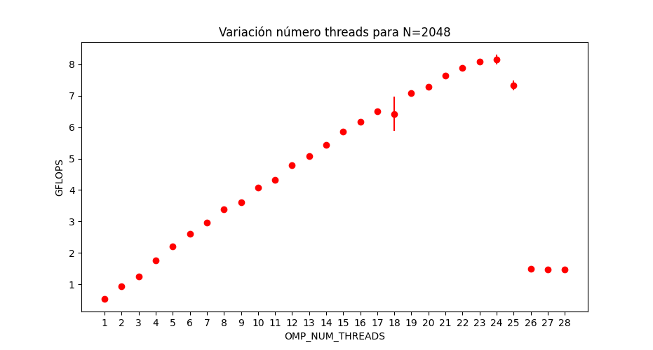


|  OMP_NUM_THREADS   |  GFLOPS  |
| :-----:            | :------: |
|  1                 |   1.42   |
|  2                 |   0.942  |
|  3                 |   1.260  |
|  4                 |   1.763  |
|  5                 |   2.208  |
|  6                 |   2.615  |
|  7                 |   2.958  |
|  8                 |   3.397  |
|  9                 |   3.606  |
|  10                |   4.085  |
|  11                |   4.316  |
|  12                |   4.786  |
|  13                |   5.083  |
|  14                |   5.442  |
|  15                |   5.867  |
|  16                |   6.159  |
|  17                |   6.503  |
|  18                |   6.423  |
|  19                |   7.074  |
|  20                |   7.288  |
|  21                |   7.625  |
|  22                |   7.878  |
|  23                |   8.088  |
|  24                |   8.154  |
|  25                |   7.326  |
|  26                |   1.504  |
|  27                |   1.476  |
|  28                |   1.470  |

## Datos escalabilidad para distintos hilos con N=2916


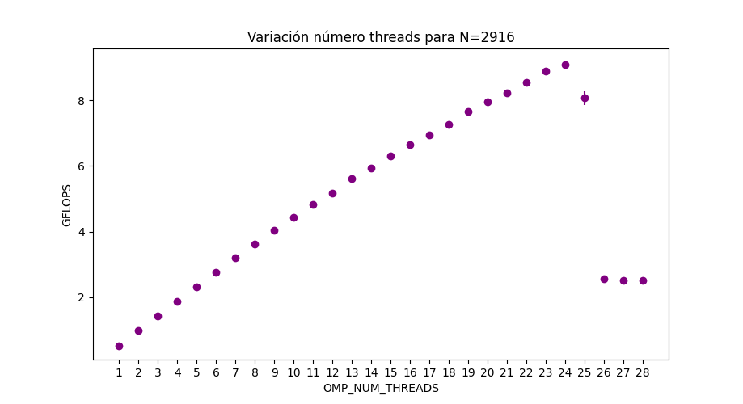


|  OMP_NUM_THREADS   |  GFLOPS  |
| :-----:            | :------: |
|  1                 |   2.42  |
|  2                 |   0.972  |
|  3                 |   1.426  |
|  4                 |   1.872  |
|  5                 |   2.324  |
|  6                 |   2.760  |
|  7                 |   3.200  |
|  8                 |   3.613  |
|  9                 |   4.042  |
|  10                |   4.435  |
|  11                |   4.839  |
|  12                |   5.180  |
|  13                |   5.625  |
|  14                |   5.934  |
|  15                |   6.296  |
|  16                |   6.657  |
|  17                |   6.957  |
|  18                |   7.274  |
|  19                |   7.658  |
|  20                |   7.959  |
|  21                |   8.237  |
|  22                |   8.549  |
|  23                |   8.881  |
|  24                |   9.092  |
|  25                |   8.069  |
|  26                |   2.551  |
|  27                |   2.517  |
|  28                |   2.521  |

## Variación distintos N con 28 hilos


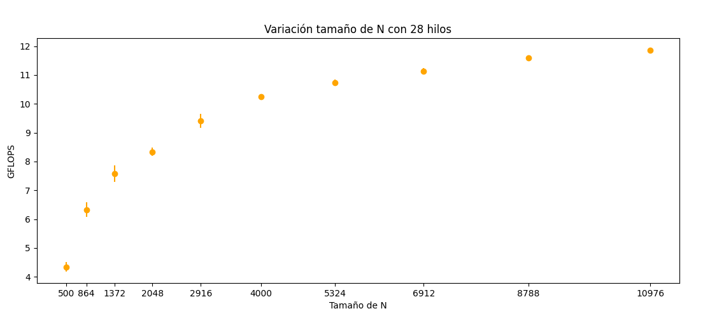


|  N                   |  GFLOPS  |
| :-----:              | :------: |
|  500                 |  4.342   |
|  864                 |  6.329   |
|  1372                |  7.582   |
|  2048                |  8.336   |
|  2916                |  9.411   |
|  4000                |  10.255  |
|  5324                |  10.739  |
|  6912                |  11.130  |
|  8788                |  11.589  |
|  10976               |  11.865  |


## Comparativa contra la mejor versión del laboratorio 2 con N=500

Con N = 500

Laboratorio 1:

* Usando GCC
* 0.45 GFlops
* Sobre código original
* Tamaño de simulación N=500

Laboratorio 2:

* Usando DPC++ Clang Intel OneApi
* 0.80 GFLops
* Sobre versión con forces implementada en ISPC
* Tamaño de simulación N=500

Laboratorio 3:

* Usando GCC
* 4.67 GFlops con 24 hilos
* Sobre versión con forces en ispc y forces calculado usando OpenMP
* Tamaño de simulación N=500


Esto en total representa una mejora aproximada de un `x5.86` o un `584 %` más de Gflops.


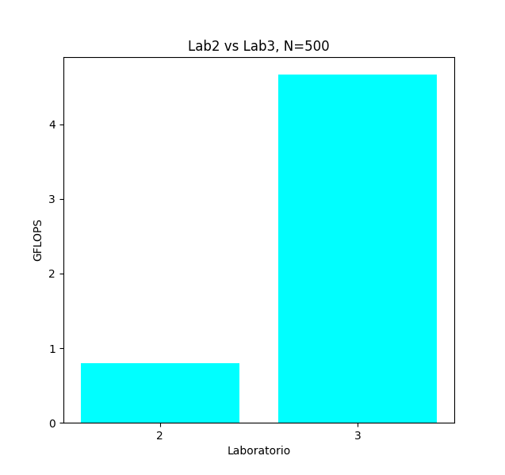


Ahora comparando entre los 3 laboratorios.


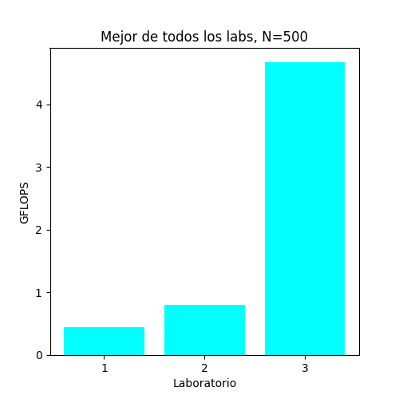


## Comparativa contra la mejor versión del laboratorio 2 con N variable

Con N = Variable

Laboratorio 1:

* Usando GCC
* 0.45 GFlops
* Sobre código original
* Tamaño de simulación N=500

Laboratorio 2:

* Usando DPC++ Clang Intel OneApi
* 0.80 GFLops
* Sobre versión con forces implementada en ISPC
* Tamaño de simulación N=500

Laboratorio 3:

* Usando GCC
* 11.865 GFlops con 28 hilos
* Sobre versión con forces en ISPC y forces calculado usando OpenMP
* Tamaño de simulación N=10976


Esto en total representa una mejora aproximada de un `x14.83` o un `1483.1%` más de Gflops.


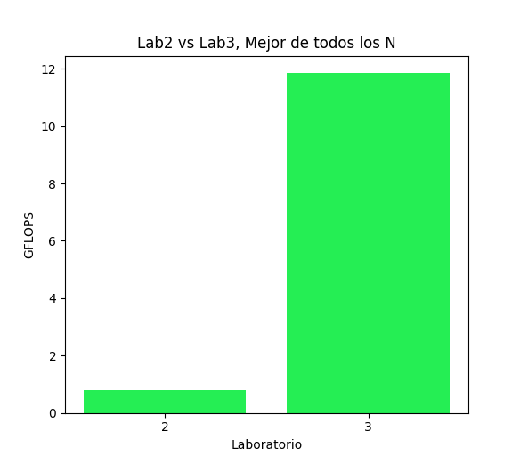


Ahora comparando entre los 3 laboratorios.


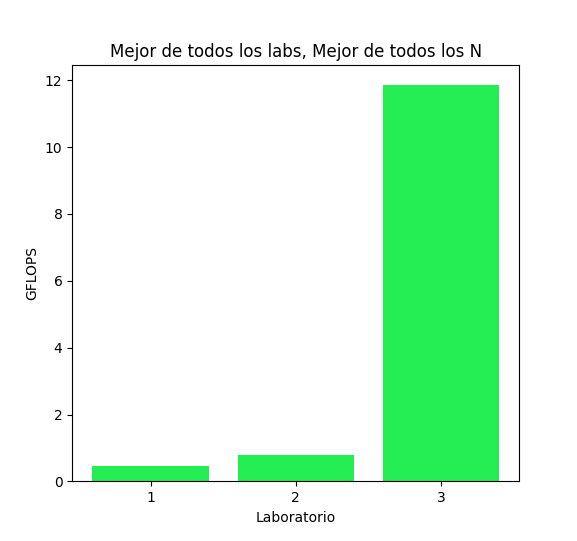


## Cálculo del speedup y la eficiencia

Con N=500


* En el laboratorio 2 el mejor tiempo fue de 12.80 segundos.
* El mejor tiempo en este lab es de 3.589 segundos con 24 hilos.

Siguiendo la formula del teórico, donde Sp es el speedup, T1 es el tiempo con 1 hilo y Tp el tiempo con p hilos:

* Nos da un Sp de (T1=12,80) / (Tp=3.589) = (3.566 = Sp)


* Y el mejor valor de la eficiencia es de (Sp=3.566) / (p=24) = 0.15 %

o también podría escribirse como:

* Eficiencia : (T1=12.80) / (p=24) x (Tp=3.589)  = 0.15 %


Este valor nos dice que estamos obteniendo un `speedup sublinear`


# Roofline con N=500

En el siguiente gráfico obtenido con `Intel Advisor-Gui` podemos ver donde está
ubicado nuestro problema respecto a la intensidad aritmética, el límite
de la velocidad de la memoria y la potencia de los procesadores.

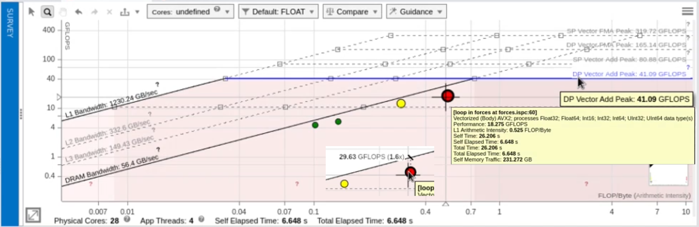

Comentarios:

* Vemos una intensidad aritmética de `0.525 FLOP/Byte`.

* El programa arroja una métrica, quizas más correcta que la que utilizamos, de `18.275 GFlops`.

* Para el punto de intensidad aritmética donde nos encontramos, el
  limite teórico impuesto por la velocidade de la memoria es de `29.63 Gflops` y
  nosotros registramos `18.275 Gflops`.

    * Esto último nos dice que todavía podríamos mejorar cerca de un 60% la performance de nuestro problema.


# Conclusiones

* El código escala muy bien a medida que aumentan los hilos.

* Se obtuvo una eficiencia sublineal de 0.15 %.

* Al utilizar 26, 27 o 28 hilos la performance cayó mucho.

* Creemos que esto es por el ruido que provocan los procesos fijos en el servidor.


# Potenciales mejoras en la paralelización.

* Realizar las pruebas para los distintos tamaños de N con 24 hilos en vez de 28.

* Aumentar el número de muestras para mejorar la confianza de los datos.

* Buscar una alternativa a la barrera  `pragma omp critical` para actualizar `epot` y `pres`.

    * `Pragma omp critical` es una estrategia muy cara a la hora de sincronizar escrituras.

* Mejorar el algoritmo de paralelización utilizando la matriz diagonal superior como lo hace el código original y no la matriz completa.

    * El trabajo que se realiza de esta manera en `Forces` es prácticamente el doble.


## Repositorio

* https://github.com/JukMR/tiny_md/
