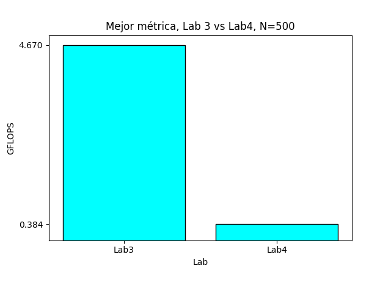

## Computación Paralela. Laboratorio IV. Tiny_MD
## González Federico(i); Mérida Julián(j)

(i) Universidad Nacional de Rosario; (j) Universidad Nacional de Córdoba

# Laboratorio 4 - Paralelización en GPUs con CUDA

# Introducción

En este laboratorio buscamos implementar el código del problema en `CUDA` para
realizar las simulaciones en las GPUs de zx81 y Jupiterace.


Para conseguir esto, queríamos utilizar la implementación paralela que
conseguimos en la laboratorio anterior para OpenMP. Es decir, nuestro nivel de
paralelismo se compone en procesar cada fila de la matriz de fuerzas por
separado. Y recordando el algoritmo original, ahora calculamos toda la matriz de
fuerzas en vez de utilizar solo la matriz diagonal.


# Objetivos

## Paralización de forces

* Paralelizar todo el código posible utilizando CUDA en las dos GPUs de zx81 y Jupiterace.

* Decidir si es conveniente resolver estas simulaciones usando las GPUs que no están hechas para trabajar con doubles.

* Reutilizar el código paralelo generado en el lab anterior.


# Modificaciones

## Implementación de la función forces en CUDA

* Implementamos todo el proyecto completo en archivos .cu.

* El tamaño de bloque elegido es el de un warp, es decir, 32 hilos por bloque.

* Elegimos una grilla de N elementos, es decir, tomamos N bloques que cada uno calcula cada fila de la matriz N * N.


La nueva implementación de `forces` en un kernel de CUDA quedó de la siguiente manera:

```C++

__global__ void forces(const double* rx, const double* ry, const double* rz,
                       double* fx, double* fy, double* fz, double* epot,
                       double* pres, const double* temp, const double rho,
                       const double V, const double L) {

    double rcut2 = RCUT * RCUT;
    const double RCUT12 = RCUT * RCUT * RCUT * RCUT * RCUT * RCUT * RCUT * RCUT * RCUT * RCUT * RCUT * RCUT;

    const double RCUT6 = RCUT * RCUT * RCUT * RCUT * RCUT * RCUT;
    const double ECUT = 4.0 * (1 / (RCUT12)-1 / (RCUT6));

    double fxi = 0.0;
    double fyi = 0.0;
    double fzi = 0.0;
    double epot_partial = 0.0;
    double pres_vir_partial = 0.0;

    unsigned int j =  threadIdx.x;
    unsigned int row =  blockIdx.x;
    for(; j < N ;j+= BLOCK_SIZE){
        if (j != row) {
            double xi = rx[row];
            double yi = ry[row];
            double zi = rz[row];

            double xj = rx[j];
            double yj = ry[j];
            double zj = rz[j];

            double rxd = xi - xj;
            double ryd = yi - yj;
            double rzd = zi - zj;

            minimum_image(rxd, L, &rxd);
            minimum_image(ryd, L, &ryd);
            minimum_image(rzd, L, &rzd);

            double rij2 = rxd * rxd + ryd * ryd + rzd * rzd;

            if (rij2 <= rcut2) {
                double r2inv = 1.0 / rij2;
                double r6inv = r2inv * r2inv * r2inv;

                double fr = 24.0 * r2inv * r6inv * (2.0 * r6inv - 1.0);

                fxi += fr * rxd;
                fyi += fr * ryd;
                fzi += fr * rzd;

                epot_partial += 4.0 * r6inv * (r6inv - 1.0) - ECUT;
                pres_vir_partial += fr * rij2;
            }
        }
    }

    atomicAdd(&fx[row], fxi);
    atomicAdd(&fy[row], fyi);
    atomicAdd(&fz[row], fzi);

    atomicAdd(epot, epot_partial / 2);
    atomicAdd(pres, pres_vir_partial / 2 / (V * 3.0));
}

```


## Lanzamiento del kernel

Y el kernel se ejecuta de la siguiente manera:

```C++

void launch_forces(const double* rx, const double* ry, const double* rz,
                   double* fx, double* fy, double* fz, double* epot,
                   double* pres, const double* temp, const double rho,
                   const double V, const double L)
{

    dim3 block(BLOCK_SIZE);
    dim3 grid(N);

    forces <<<grid, block>>> (rx, ry, rz, fx, fy, fz, epot, pres, temp, rho, V, L);

    checkCudaError(cudaGetLastError());
    checkCudaError(cudaDeviceSynchronize());
}

```


## Plataforma de cálculos

Los simulaciones se corrieron sobre Jupiterace y sobre zx81. Ambas tienen el
mismo procesador pero GPUs distintas:

CPU:

 * Intel(R) Xeon(R) CPU E5-2680 v4 @ 2.4
 * 28 cores, 56 threads con smt habilitado,
 * Processor frequency : 2.4 - 3.3 GHz
 * Caches:
    * L1 data: 896 KiB
    * L1 instr.: 896 KiB
    * L2: 7 MiB
    * L3: 70 MiB
* Memoria RAM: 128 GB


GPU:

| Jupiterace                    | zx81                     |
|-------------------------------|------------------------------|
| GeForce RTX 2080 Ti           | GeForce RTX 3070             |
| Cuda Cores: 4352              | Cuda cores: 5888             |
| Processor frequency: 1.35 GHz | Processor frequency: 1.5 GHz |
| SM: 68                        | SM:46                        |
| Arch: 7.5                     | Arch: 8.6                    |
| Memory Bus Width: 352 bit     | Memory Bus Width: 256 bit    |
| Bandwidth: 616 GB/s           | Bandwidth: 448 GB/s          |
| RAM 11 GB GDDR6               | RAM 8GB GDDR6                |


## Compiladores

Para este laboratorio usamos:

* nvcc 11.2 con **-arch=sm_75** para la Geforce RTX 2080 Ti en Jupiterace.

* nvcc 11.2 con **-arch=sm_86** para la Geforce RTX 3070 en zx81.

# Resultados

Primero realizamos las simulaciones en ambos servidores para

* N = [32, 108, 256, 500, 864, 1372, 2048, 2916, 4000, 5324, 6912, 8788, 10976]

Luego, vimos que los resultados eran mucho mejores para `Jupiterace`, entonces probamos en este servidor para N más grandes:

* N = [13500, 16384, 19652, 23328, 27436]

en donde 27436 es el N más grande que pudimos probar dentro del límite de tiempo que establece `Slurm`.

## Jupiterace


| N     | GFLOPS  | Tiempo(segundos) |
|-------|---------|------------------|
| 32    | 0.0028  | 14.8728          |
| 108   | 0.0178  | 26.8817          |
| 256   | 0.0912  | 29.6062          |
| 500   | 0.3837  | 26.9386          |
| 864   | 1.557   | 19.8792          |
| 1372  | 3.78    | 20.6387          |
| 2048  | 6.0947  | 28.4511          |
| 2916  | 8.5519  | 41.0087          |
| 4000  | 10.1227 | 65.064           |
| 5324  | 11.6842 | 99.6981          |
| 6912  | 13.3103 | 147.3967         |
| 8788  | 14.5421 | 217.953          |
| 10976 | 14.9863 | 329.8254         |
| 13500 | 15.7307 | 475.2424         |
| 16384 | 15.8653 | 693.9497         |
| 19652 | 16.5243 | 958.4626         |
| 23328 | 17.0538 | 1308.5541        |
| 27436 | 17.1784 | 1796.7899        |


## zx81

| N     | GFLOPS  | Tiempo (segundos) |
|-------|---------|-------------------|
| 108   | 0.0192  | 24.9088           |
| 256   | 0.089   | 30.3395           |
| 500   | 0.3046  | 33.8457           |
| 864   | 1.0375  | 29.7165           |
| 1372  | 2.638   | 29.4901           |
| 2048  | 5.7643  | 30.0809           |
| 2916  | 7.4951  | 46.7614           |
| 4000  | 8.5402  | 77.0529           |
| 5324  | 9.7654  | 119.2475          |
| 6912  | 10.7212 | 182.9202          |
| 8788  | 11.482  | 275.9799          |
| 10976 | 11.8026 | 418.6989          |


## Comparación Gflops


## Comparación Segundos


# Comparación de Tiempos para los distintos Labs en Jupiterace

La siguientes tablas comparan los tiempos que tardaron las diferentes versiones
del programa en ejecutarse con distintos números de partículas.

Las celdas que aparecen con `-` no se calcularon por la cantidad de tiempo que
tomaban en ejecutarse o porque no se calcularon sus valores en los laboratorios
correspondientes.

| Laboratorio        | Options      | N=500    | N=1372   | N=4000 | N=13500 |
|--------------------|--------------|----------|----------|--------|---------|
| L1:clang/gcc/intel | -O3          |  23 seg  |    77    |   576  |   6163  |
| L1:(intel)clang    | -O3          | 13.1 seg |     -    |    -   |    -    |
| L2:ISPC            | avx2-i64x4   | 12.8 seg |     -    |    -   |    -    |
| L3:OpenMP          | N_THREADS=25 |  3.5 seg |  11 seg  | 78 seg | 795 seg |
| L4:CUDA            | WARP_SIZE=32 | 26.9 seg | 20.6 seg | 65 seg | 475 seg |


**Tabla normalizando los valores para la primera fila:**

| Laboratorio        | Options      | N=500 | N=1372 | N=4000 | N=13500 |
|--------------------|--------------|-------|--------|--------|---------|
| L1:clang/gcc/intel | -O3          |   1   |    1   |    1   |    1    |
| L1:(intel)clang    | -O3          |  1.76 |    -   |    -   |    -    |
| L2:ISPC            | avx2-i64x4   |  1.8  |    -   |    -   |    -    |
| L3:OpenMP          | N_THREADS=25 |  6.57 |    7   |  7.38  |   7.75  |
| L4:CUDA            | WARP_SIZE=32 |  0.86 |  3.68  |  8.86  |    13   |


## Comparación de tiempos

La siguiente gráfica compara los valores anteriores para contrastar las diferencias de tiempos, está realizada con la tabla normalizada:


# Comparación Lab3 vs Lab4 distintos números de partículas


## Para distintos N:

### ***Jupiterace***


**Para N=10976**

* En esta GPU la performance dio de **14.99 Gflops**

* La mejor métrica del laboratorio anterior era de **11.87 Gflops**

* Esto representa una mejora de **x1.26** o un **126%** de mejoría


**Para N=Variable**

* En esta GPU la mejor performance se dio con **N=27436** performance y fue de  **17.18 Gflops**

* La mejor métrica del laboratorio anterior con **N=10976** era de **11.87 Gflops**

* Esto representa una mejora de **x1.44** o un **144%** de mejoría


### ***zx81***


**Para N=10976**

* La mejor métrica en esta GPU dio **11.80 Gflops**

* La mejor métrica del laboratorio anterior era de **11.87 Gflops**

* Esto representa una ralentización de **x0.99** o un **99.4%** de la versión original


### Resultados Jupiterace vs zx81


* Con estos resultados vemos que el código obtuvo mejores métricas en Jupiterace, sobre la GeForce RTX 2080 Ti.

* Por lo tanto elegimos estos resultados como las mejores métricas para las siguientes comparaciones con los labs anteriores.


# Comparación mejores mediciones Lab 3 vs Lab4

## Para N=500





* La mejor métrica de este laboratorio con este tamaño de muestra es de **0.38 Gflops**.

* La mejor métrica del laboratorio anterior era de **4.67 Gflops** con 24 hilos en **OpenMP**.

* Esto representa un ralentizamiento de **x0.08** o solo un **0.08%** de la performance original.


### Para todos los labs


## Comparación Lab3 vs Lab4, N=Variable


**N=10976**

* La mejor métrica de este laboratorio es de **14.99 Gflops**.

* Si lo comparamos contra la mejor medición anterior de **11.87 Gflops** con **N=10976** con 28 hilos con OpenMP.

* Esto representa una mejora de **x1.26** o un **126 %** de mejoría.


### Comparación todos los labs para mejor N


En esta gráfica podemos ver la comparación final de los 4 labs para los mejores
N que pudimos medir en cada uno de ellos.

Aquí se encuentran dos mediciones del Lab4 dado que estamos mostrando la del
mejor **N=10976** que permite compararse con el Lab3 y la mejor que pudimos
conseguir dentro del límite de tiempo establecido por `Slurm` en Jupiterace con
**N=27436**.


# Roofline para N=10976


El gráfico del Roofline nos muestra en qué punto se encuentra la performance de
nuestro código. Aparecen dos puntos, el de la izquierda corresponde con la
intensidad aritmética de las operaciones de punto flotante simple, las cuales
suponemos que son implementaciones personales del compilador CUDA, y el de la
derecha, que es la que nos interesa, es la intensidad aritmética de punto de
doble precisión.

Como estamos entre 1 000 y 10 000 FLOP/byte, y nos encontramos bastante a la
derecha de la pendiente de la recta, vemos que nuestra performance se está
limitando por falta de poder de cálculo y no de memoria.

Esto tiene mucho sentido dado que el código se esta corriendo sobre una `RTX
GeForce 2080 Ti` que no posee muchas unidades de cálculo para punto flotante de
doble precisión. En particular, posee solo `1/32` comparado con el total de
unidades para cálculo de precisión simple.

Además, el valor de performance (FLOP/s) obtenido se encuentra muy cerca del
máximo teórico posible sobre cálculos de doble precisión. Esto nos dice que
estamos aprovechando bien los recursos de cómputo que tenemos disponibles.

Por último, se eligió este número de partículas para poder obtener los datos del
roofline en un tiempo razonable, ya que el profiling toma bastante más tiempo
que la ejecución normal de la simulación.


# Conclusiones


* Aunque estas GPU no están hechas para doubles, escalan mejor que `OpenMP` para N mayores a **5324**.

    * Para tamaños de problema mayores a este N, si es conveniente utilizar CUDA.

* La `RTX 2080 Ti` dio resultados mucho mejores que la `RTX 3070`.

* En el mismo tiempo de simulación, se obtuvo un incremento de **x1.45 GFLOPS** entre el lab3 con **N=10976 **y lab4 con **N=27436**.


# Potenciales mejoras en la paralelización.

* Mejora pendiente del Lab3, implementar un algoritmo que trabaje utilizando solo la matriz diagonal de fuerzas en vez de la matriz entera N * N.

    * (Esto reduciría los cálculos a la mitad).

* Probar la performance del programa en una GPU con mayor soporte para punto flotante de doble precisión.


## Extra, comparación float vs double en Jupiterace

Para ver cuánta performance estábamos perdiendo al estar trabajando con doubles
en vez de floats, modificamos la última versión del proyecto para que trabaje
con floats en lugar de doubles y obtuvimos los siguientes resultados:


Estos resultados son interesantes ya que se observa que la performance esta
cerca del doble entre utilizar float y doubles. Un resultado lejos del 1/32 que
pensábamos que podíamos obtener en un principio. Esto refleja que gran parte del
problema se da por una limitación del ancho de banda de la memoria y no por
falta de poder de cálculo, queda para seguir investigando los resultados que daría el roofline en el caso del programa float.


## Repositorio

* https://github.com/JukMR/tiny_md/
